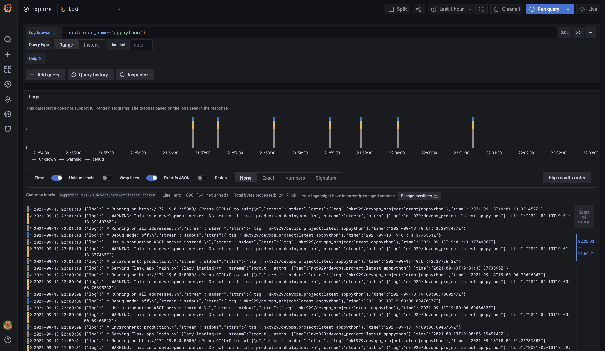

# Loki and Promtail screenshot

# Monitoring Best Practices
1. Identify and Monitor the Problem Areas
2. Focus on Processes
3. Set the Monitoring in Context
4. Prepare for Specific Monitoring Situations